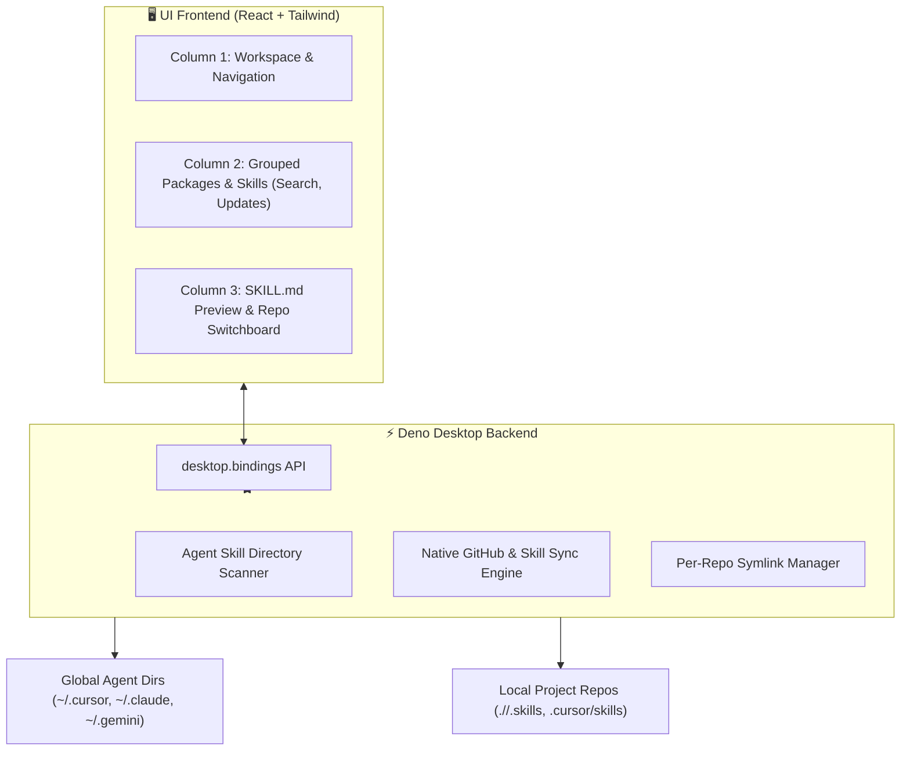

# Skillet: Desktop AI Agent Skills Manager

## 1. Overview

**Skillet** is a modern, lightweight desktop application built with **Deno Desktop** and **React** for discovering, installing, updating, and toggling AI Agent Skills (following the open `SKILL.md` / `skills.sh` standard) both globally and on a per-repository basis.

Inspired by macOS utilities and the 3-column layout of tools like Vesper, Skillet gives developers visual control over which skills are active in each project, across all major AI coding agents (Cursor, Claude Code, Antigravity/Gemini, Windsurf, OpenCode, Codex, Copilot).

---

## 2. Architecture & Tech Stack

### Core Technologies
- **Runtime & Desktop Shell**: [Deno Desktop](https://docs.deno.com/runtime/desktop/) (`deno desktop`)
  - 100% TypeScript across frontend and backend.
  - Native OS WebView backend (~40 MB app size, low memory consumption).
  - In-process communication channels via `Deno.BrowserWindow` and `desktop.bindings`.
  - Built-in binary-diff auto-update and native menu/window support.
- **Frontend Framework**: React 19 + TypeScript + Vite.
- **Styling & Components**: Tailwind CSS v4 + Lucide Icons.
- **State & Data Caching**: TanStack Query + lightweight local state.
- **Markdown & Frontmatter**: Remark / Markdown-it + YAML frontmatter parser for `SKILL.md` rendering.

### System Architecture

---

## 3. UI Layout & User Experience

Skillet uses a **3-column desktop layout**:

### Column 1: Left Sidebar (Navigation & Workspaces)
- **Workspace Switcher**:
  - `Global Scope` (Default)
  - List of pinned / tracked Git repositories (with "+" button to browse/add local projects).
- **Navigation Tabs**:
  - ⚡ **Skills** (Browse installed & discoverable skills)
  - 🤖 **Agents** (Claude Code, Cursor, Antigravity, Windsurf, OpenCode, Codex, Copilot status)
  - 📝 **Prompts** (Inspect skill prompt templates & tools)
  - ⚙️ **Settings** (Custom skill search paths, GitHub API token, telemetry settings)

### Column 2: Center List (Packages & Skills Explorer)
- **Header Toolbar**:
  - Total count badge (e.g. `58 skills`).
  - **`+ New`** button (Add custom skill from URL or local folder).
  - **`Search skills and prompts...`** input box (fuzzy filter by name, trigger command, or author).
  - **`Check for updates`** button (checks remote GitHub commits/tags).
  - **`Rescan`** button (re-indexes local agent directories).
- **Grouped List View**:
  - Grouped by package / author (e.g., `cursor/plugins`, `vercel-labs/skills`, `mattpocock-skills`, `Global skills`).
  - Item row shows skill icon, trigger name (e.g. `/architect`, `/web-design-guidelines`), and an update badge if an upstream update is detected.

### Column 3: Right Detail Pane (Preview & Switchboard)
- **Header**: Package name, author avatar, scope badge (`Global`, `Package`, `Project: skillet`).
- **Quick Action Bar**:
  - Install / Uninstall
  - Update to Latest
  - Enable / Disable for Current Selected Workspace
- **Metadata Card**:
  - Source repo / URL
  - Provider (GitHub / Local)
  - Target Agents supported
  - Skill file path on disk
- **Live `SKILL.md` Preview**:
  - Rich Markdown viewer rendering description, instructions, tools, and example triggers.
- **Per-Repository Matrix**:
  - Table of tracked projects with toggle switches to turn this skill ON or OFF per repository via symlinks.

---

## 4. Backend Engine & Filesystem Operations

### 1. Agent Directory Scanner
Scans and discovers skills in standard paths:
- **Claude Code**: `~/.claude/skills/` (Global) and `<repo>/.claude/skills/` (Local)
- **Cursor**: `~/.cursor/skills/` (Global) and `<repo>/.cursor/skills/` (Local)
- **Antigravity / Gemini**: `~/.gemini/config/skills/`
- **Open Standards**: `~/.skills/` and `<repo>/.skills/`

### 2. Per-Repo Symlink Management
- Enabling a skill for a repo creates a symbolic link from the central cached repository (`~/.skills/<owner>/<repo>/skills/<name>`) directly into the target project's agent directory (e.g. `<repo>/.cursor/skills/<name>`).
- Disabling simply unlinks the folder safely without touching the source repository.

### 3. Update Checker & Version Sync
- Compares local tree SHA / commit hash stored in `skills-lock.json` against the upstream GitHub repository.
- Flags any outdated skills with an "Update available" badge.
- One-click update downloads upstream diffs and updates symlinks seamlessly.

---

## 5. Security & Error Handling

- **No Remote Arbitrary Execution**: Skillet only reads `SKILL.md` markdown files and manages symlinks; it does not execute untrusted scripts without user confirmation.
- **Safe Symlink Traversal**: Validates paths to prevent directory traversal outside of configured workspaces.
- **Graceful Offline Fallback**: Cached skills and local files remain fully operational when offline.
